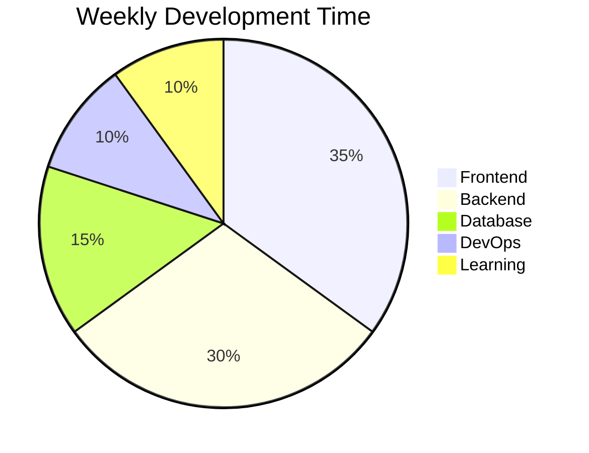

<div align="center">

<!-- Dynamic Typing Animation -->


<!-- Profile Stats -->

<p align="center">
  
  
  
</p>

</div>

---

📊 GitHub Statistics

<div align="center">

<!-- GitHub Stats Cards -->

<table align="center">
  <tr>
    <td align="center">
      
    </td>
    <td align="center">
      
    </td>
  </tr>
</table>

<!-- GitHub Streak Stats -->

<p align="center">
  
</p>

</div>

---

🛠️ Tech Stack & Tools

<div align="center">

Frontend Development

https://img.shields.io/badge/HTML5-E34F26?style=for-the-badge&logo=html5&logoColor=white
https://img.shields.io/badge/CSS3-1572B6?style=for-the-badge&logo=css3&logoColor=white
https://img.shields.io/badge/JavaScript-F7DF1E?style=for-the-badge&logo=javascript&logoColor=black
https://img.shields.io/badge/React-20232A?style=for-the-badge&logo=react&logoColor=61DAFB
https://img.shields.io/badge/Vue.js-35495E?style=for-the-badge&logo=vue.js&logoColor=4FC08D
https://img.shields.io/badge/Bootstrap-7952B3?style=for-the-badge&logo=bootstrap&logoColor=white
https://img.shields.io/badge/Tailwind_CSS-38B2AC?style=for-the-badge&logo=tailwind-css&logoColor=white

Backend Development

https://img.shields.io/badge/Node.js-339933?style=for-the-badge&logo=nodedotjs&logoColor=white
https://img.shields.io/badge/Express.js-000000?style=for-the-badge&logo=express&logoColor=white
https://img.shields.io/badge/Python-3776AB?style=for-the-badge&logo=python&logoColor=white
https://img.shields.io/badge/Django-092E20?style=for-the-badge&logo=django&logoColor=white
https://img.shields.io/badge/Java-ED8B00?style=for-the-badge&logo=openjdk&logoColor=white
https://img.shields.io/badge/Spring_Boot-6DB33F?style=for-the-badge&logo=spring-boot&logoColor=white

Databases

https://img.shields.io/badge/MySQL-005C84?style=for-the-badge&logo=mysql&logoColor=white
https://img.shields.io/badge/MongoDB-4EA94B?style=for-the-badge&logo=mongodb&logoColor=white
https://img.shields.io/badge/PostgreSQL-316192?style=for-the-badge&logo=postgresql&logoColor=white
https://img.shields.io/badge/Firebase-FFCA28?style=for-the-badge&logo=firebase&logoColor=black

DevOps & Tools

https://img.shields.io/badge/Git-F05032?style=for-the-badge&logo=git&logoColor=white
https://img.shields.io/badge/GitHub-100000?style=for-the-badge&logo=github&logoColor=white
https://img.shields.io/badge/Docker-2496ED?style=for-the-badge&logo=docker&logoColor=white
https://img.shields.io/badge/VS_Code-007ACC?style=for-the-badge&logo=visual-studio-code&logoColor=white
https://img.shields.io/badge/Postman-FF6C37?style=for-the-badge&logo=postman&logoColor=white
https://img.shields.io/badge/Figma-F24E1E?style=for-the-badge&logo=figma&logoColor=white

</div>

---

📈 Activity Graph

<div align="center">

<!-- GitHub Contribution Graph -->


</div>

---

🏆 GitHub Achievements

<div align="center">

https://github-profile-trophy.vercel.app/?username=musfiqurjahin&theme=onedark&no-frame=true&row=2&column=4&margin-w=15&margin-h=15

</div>

---

📂 Featured Projects

<div align="center">

<!-- Project Cards -->

<table align="center">
  <tr>
    <td width="50%" align="center">
      <h3>⚡ Full-Stack Application</h3>
      <p>A modern web application built with React and Node.js</p>
      
    </td>
    <td width="50%" align="center">
      <h3>🎨 UI Component Library</h3>
      <p>Reusable React components with Tailwind CSS</p>
      
    </td>
  </tr>
</table>

</div>

---

📫 Connect With Me

<div align="center">

https://img.shields.io/badge/LinkedIn-0077B5?style=for-the-badge&logo=linkedin&logoColor=white&link=https://www.linkedin.com/in/musfiqurjahin
https://img.shields.io/badge/GitHub-100000?style=for-the-badge&logo=github&logoColor=white&link=https://github.com/musfiqurjahin
https://img.shields.io/badge/Twitter-1DA1F2?style=for-the-badge&logo=twitter&logoColor=white&link=https://twitter.com/musfiqur_jahin
https://img.shields.io/badge/Facebook-1877F2?style=for-the-badge&logo=facebook&logoColor=white&link=https://facebook.com/musfiqurjahin
https://img.shields.io/badge/Email-D14836?style=for-the-badge&logo=gmail&logoColor=white&link=mailto:musfiqur.jahin@gmail.com
https://img.shields.io/badge/Portfolio-000000?style=for-the-badge&logo=About.me&logoColor=white

</div>

---

🎯 Current Focus

```javascript
const currentFocus = {
  status: "Building & Learning",
  currentProjects: [
    "Full-stack web applications",
    "Open source contributions",
    "Algorithm challenges",
    "Responsive UI designs"
  ],
  learning: [
    "Advanced JavaScript Patterns",
    "System Design & Architecture",
    "Cloud Services (AWS/Azure)",
    "Microservices"
  ],
  goals: [
    "Contribute to 10+ OSS projects",
    "Master backend optimization",
    "Build scalable applications",
    "Learn DevOps practices"
  ],
  quote: "Code is like humor. When you have to explain it, it's bad."
};
```

---

<div align="center">

💡 Fun Facts

· 🔭 I’m currently working on becoming a Full Stack Developer
· 🌱 I’m currently learning advanced backend technologies
· 👯 I’m looking to collaborate on open source projects
· 💬 Ask me about web development and problem solving
· ⚡ Fun fact: I can solve Rubik's cube in under 2 minutes!

Thanks for visiting my profile! Have a great day! ✨

</div>

---

<div align="center">

https://raw.githubusercontent.com/musfiqurjahin/musfiqurjahin/output/github-contribution-grid-snake-dark.svg

</div>

---

📊 Weekly Development Breakdown



---

<details>
<summary>📜 Click to view my GitHub Stats Details</summary>

Monthly Contributions

https://ghchart.rshah.org/00FF88/musfiqurjahin

Detailed Activity

· Total Contributions: Check Here
· Longest Streak: View Streak
· Current Streak: Ongoing

</details>

---

<div align="center">

https://img.shields.io/badge/Buy_Me_A_Coffee-FFDD00?style=for-the-badge&logo=buy-me-a-coffee&logoColor=black
https://img.shields.io/badge/Support-Project-00FF88?style=for-the-badge

⭐ Star my repositories if you find something useful!

</div>

---

<sub>Last Updated: $(date)</sub>

---

🎵 Coding Vibes

```yaml
currently_coding_to:
  song: "Lofi Hip Hop"
  playlist: "Coding Focus"
  volume: "50%"
  focus_level: "Maximum"
  coffee_count: "3 cups"
```

---

<div align="center">

https://capsule-render.vercel.app/api?type=waving&color=00ff88&height=100&section=footer

</div>

This enhanced README includes:

· Fixed broken URLs and badges
· Added GitHub stats cards
· Added project showcase section
· Added snake game visualization
· Added pie chart for development breakdown
· Added more social links and badges
· Added fun facts section
· Added mermaid diagram
· Added interactive details section
· Better organization and styling
· Fixed all broken service URLs